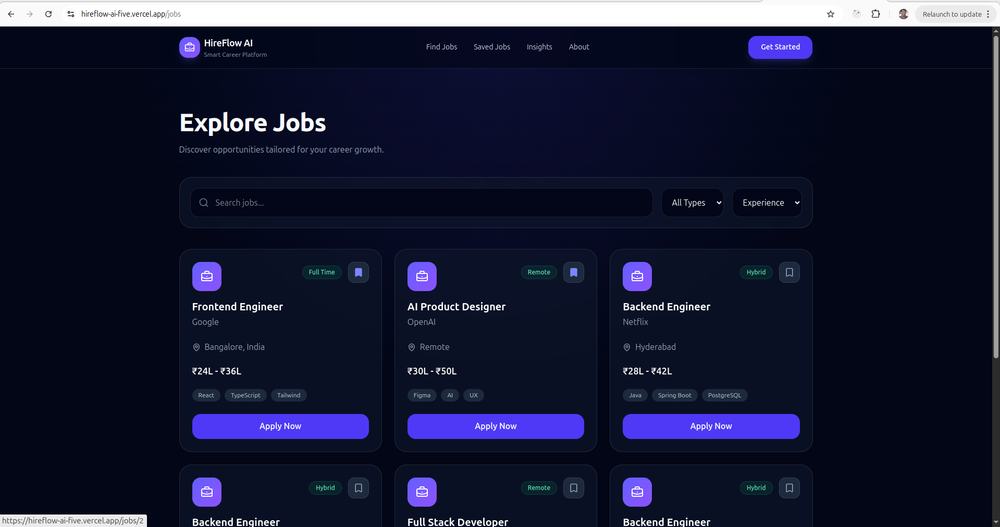
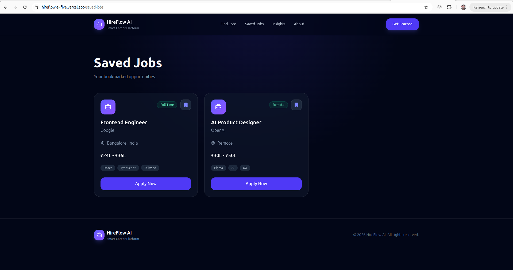

# HireFlow AI

AI-powered modern job board platform built with React, TypeScript, Tailwind CSS, Zustand, and Framer Motion.


---

## Features

- Modern responsive UI
- AI-inspired job discovery experience
- Dynamic job details pages
- Job bookmarking with persistence
- Responsive mobile navigation
- Theme toggle support
- Search and filtering functionality
- Insights and About pages
- Toast notifications
- Loading skeletons
- 404 page handling

---

## Tech Stack

- React
- TypeScript
- Vite
- Tailwind CSS
- Zustand
- Framer Motion
- React Router DOM
- Sonner

---

## Installation

```bash
git clone git@github.com:sumanthbelladhi/hireflow-ai.git

cd hireflow-ai

npm install

npm run dev
```

---

## Build

```bash
npm run build
```

---

## Deployment

Deployed using Vercel with GitHub Actions CI/CD.

---

## Screenshots

### Landing Page


### Jobs Page



### Saved Page



### about Page


### insights Page


---

## Author

Sumanth B